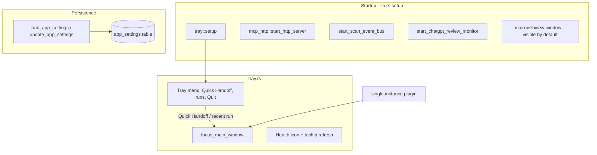
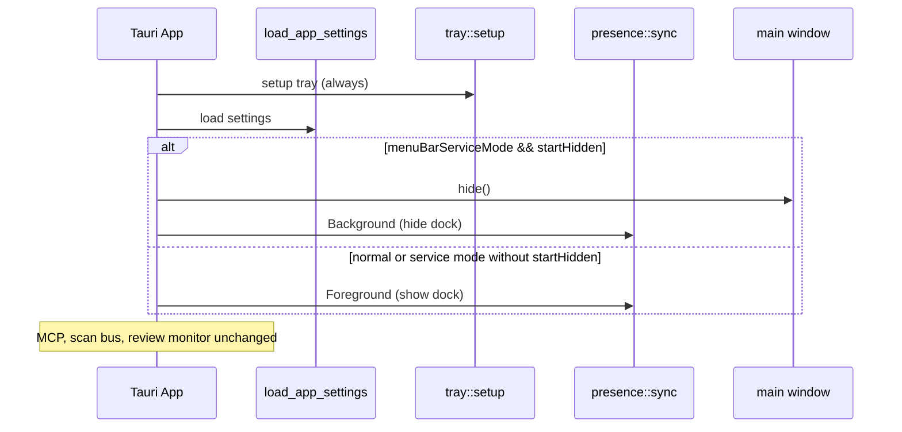

# Menu Bar Service Mode — Implementation Plan

**Status:** Approved — implementation in progress
**Date:** 2026-06-15  
**Project:** AgentDeck (Tauri 2 / macOS-first)

---

## Overview

AgentDeck already runs a menu-bar tray (green / yellow / red health dot) with Quick Handoff, recent runs, and Quit. Today the main window still appears in the Dock and launches visible on startup. This plan adds an optional **menu-bar service mode**: the app keeps running in the background with no Dock icon, and the full GUI is opened only when the user chooses **Open AgentDeck** from the tray menu (or when a relaunch focuses an existing instance).

The control plane (MCP HTTP server, environment scan bus, ChatGPT review monitor, webhooks) continues running while the window is hidden.

---

## Background & Motivation

| Current behavior | Pain point |
|------------------|------------|
| App shows in Dock on launch | Competes with other dev tools; feels like a foreground app even when only the tray dot is needed |
| Close (red) button quits or closes per OS default | Easy to accidentally stop background services |
| Tray left-click opens menu; Quick Handoff focuses window | No explicit “open the app” entry; Dock is the main recovery path |
| `tauri-plugin-single-instance` focuses window on relaunch | Good, but still assumes a visible Dock presence |

The user wants AgentDeck to behave like a **local agent service**: always available via the menu-bar dot, full UI on demand.

---

## Goals

1. **Optional menu-bar-only mode** — hide Dock icon; keep tray icon and background workers alive.
2. **Tray context menu** — add **Open AgentDeck** (show + focus main window) and **Hide to Menu Bar** (hide window + hide Dock when mode is on).
3. **Persist preference** in existing `app_settings` SQLite keys (same pattern as `router_auto_apply`).
4. **Close-button semantics** — when service mode is enabled, window close hides to tray instead of quitting (unless user chooses Quit from tray).
5. **Single-instance relaunch** — second launch focuses/shows window (already partially implemented in `lib.rs` via `focus_main_window`).
6. **Settings UI** — toggle in Settings with clear copy explaining Dock vs menu-bar behavior.
7. **Dev workflow safe** — `pnpm dev:app` remains usable; dev builds can default to showing Dock for debugging.

## Non-Goals (this phase)

- Windows or Linux parity (macOS-only for Dock / activation policy).
- Replacing the tray with a native Swift menu-bar helper.
- Changing MCP tunnel, handoff, or scan intervals.
- Removing the ability to run as a normal Dock app (both modes must coexist).

---

## Current Architecture (relevant pieces)



**Key files today:**

| File | Role |
|------|------|
| `src-tauri/src/tray.rs` | Tray icon, menu, `focus_main_window` |
| `src-tauri/src/lib.rs` | Setup, single-instance, invoke handlers |
| `src-tauri/tauri.conf.json` | Main window config (no `visible: false`) |
| `src-tauri/src/models.rs` | `AppSettings` struct |
| `src-tauri/src/storage.rs` | Bool settings in `app_settings` |
| `src/features/settings/SettingsView.tsx` | Settings UI |
| `scripts/dev-agentdeck.sh` | Dev focus via PID (not `tell application "AgentDeck"`) |

---

## Proposed Design

### 1. New settings fields

Add to `AppSettings` / `AppSettingsUpdateRequest` / TypeScript `AppSettings`:

| Field | Type | Default | Meaning |
|-------|------|---------|---------|
| `menuBarServiceMode` | `bool` | **`true`** | When true: hide Dock on startup (if window hidden), close hides window, apply accessory-style presence |
| `startHidden` | `bool` | **`true`** | When true **and** `menuBarServiceMode`: launch with main window hidden (tray only) |
| `closeHidesToMenuBar` | `bool` | `true` | When true **and** `menuBarServiceMode`: red close button hides window instead of quitting |
| `launchAtLogin` | `bool` | `false` | Register AgentDeck as a login item via `tauri-plugin-autostart` |

Storage keys (SQLite `app_settings`): `menu_bar_service_mode`, `start_hidden`, `close_hides_to_menu_bar`, `launch_at_login`.

`closeHidesToMenuBar` defaulting to `true` matches the “service” mental model; users who want close-to-quit can disable it in Settings.

### 2. Rust module: `presence.rs` (new)

Centralize Dock / window visibility so tray, settings commands, and window events share one code path.

```rust
pub enum AppPresence {
    Foreground,   // Dock visible, window shown
    Background,   // Dock hidden, window hidden, tray active
}

pub fn apply_presence(app: &AppHandle, presence: AppPresence) -> Result<(), String>;
pub fn show_main_window(app: &AppHandle) -> Result<(), String>;  // show + unminimize + focus + Foreground
pub fn hide_main_window(app: &AppHandle) -> Result<(), String>;  // hide + Background (if service mode)
pub fn sync_presence_from_settings(app: &AppHandle) -> Result<(), String>;
```

**macOS Dock hiding (preferred order):**

1. **Tauri `set_dock_visibility(false)`** via `AppHandle` — already permitted under `core:app:default`; no Info.plist change required; can toggle at runtime when user enables/disables service mode.
2. **Fallback:** `objc2` / `NSApplication::setActivationPolicy(Accessory)` only if `set_dock_visibility` proves insufficient (e.g. Cmd-Tab behavior). Defer unless QA finds gaps.

Do **not** set `LSUIElement` in Info.plist globally — that would remove Dock permanently and complicate normal mode. Runtime toggle is the goal.

### 3. Startup sequence (updated `lib.rs` setup)



**Onboarding exception:** If `onboarding_complete == false`, always show the window on first run regardless of `startHidden`, so new users are not stranded behind a tray-only launch.

### 4. Tray menu changes (`tray.rs`)

Rebuild menu structure (top → bottom):

| Item | Enabled when | Action |
|------|----------------|--------|
| **Open AgentDeck** | always | `presence::show_main_window` |
| **Hide to Menu Bar** | service mode on **and** main window visible | `presence::hide_main_window` |
| *(separator)* | | |
| Quick Handoff | always | focus + `navigate-view` Handoffs (unchanged) |
| *(separator)* | | |
| Recent run ×3 | when runs exist | unchanged |
| *(separator)* | | |
| Quit | always | `app.exit(0)` |

**Dynamic labels:** When window is hidden, show **Open AgentDeck** as primary; optionally dim **Hide to Menu Bar**. Refresh menu after show/hide via `tray::refresh_menu_visibility(app)` called from `presence.rs`.

**Left-click behavior:** Keep `show_menu_on_left_click(true)` — clicking the green dot opens the context menu (matches user request). No change to click-to-open-window (that would conflict with menu-first UX).

### 5. Window close interception

In `lib.rs` setup, after window creation:

```rust
window.on_window_event(|window, event| {
    if let WindowEvent::CloseRequested { api, .. } = event {
        if should_hide_on_close(&app) {
            api.prevent_close();
            let _ = presence::hide_main_window(app);
        }
    }
});
```

When `closeHidesToMenuBar` is false but service mode is on, allow default quit-on-close (or map to `app.exit` — product choice: default hide).

### 6. Settings UI (`SettingsView.tsx`)

New **Presence** section (above or within hardening settings):

- **Run in menu bar only** (`menuBarServiceMode`) — master toggle; helper text: “Hide Dock icon and keep AgentDeck running in the menu bar.”
- **Start hidden** (`startHidden`) — disabled unless master toggle on.
- **Close button hides to menu bar** (`closeHidesToMenuBar`) — disabled unless master toggle on.

On save: invoke `update_app_settings` then new command `sync_app_presence` (or return applied presence from update) so Dock toggles immediately without restart.

### 7. New Tauri commands

| Command | Purpose |
|---------|---------|
| `sync_app_presence` | Re-read settings and apply Foreground/Background |
| `show_main_window` | Tray / frontend callable show |
| `hide_main_window` | Tray / frontend callable hide |
| `is_main_window_visible` | Optional; for menu state if needed |

Register in `lib.rs` `invoke_handler`. Frontend `invoke.ts` wrappers as needed.

### 8. Single-instance behavior

Existing handler:

```rust
tauri_plugin_single_instance::init(|app, _args, _cwd| {
    tray::focus_main_window(app);
});
```

Update to `presence::show_main_window(app)` so Dock reappears when service mode user relaunches from Spotlight or `open -a AgentDeck`.

### 9. Dev vs production

| Context | Behavior |
|---------|----------|
| **Production** | Respect saved settings |
| **`pnpm dev:app` / debug** | If `AGENTDECK_DEV_SHOW_DOCK=1` (default in dev script), force Foreground on startup so the window is easy to find; still test hide/show manually |
| **Focus** | Keep PID-based `System Events` focus in `dev-agentdeck.sh` — never `tell application "AgentDeck"` |

Document env override in `AGENTS.md` / dev script comment.

---

## API / Interface Changes (summary)

**Rust `AppSettings`:** +3 bool fields (camelCase serde).  
**TypeScript `AppSettings`:** mirror fields.  
**Tray:** +2 menu items, dynamic enablement.  
**New module:** `src-tauri/src/presence.rs`.  
**Capabilities:** Confirm `core:app:allow-set-dock-visibility` included (likely via `core:default`); add explicit permission if deny path hit during QA.

---

## Alternatives Considered

| Alternative | Pros | Cons | Decision |
|-------------|------|------|----------|
| `LSUIElement` in Info.plist | True menu-bar agent | Permanent; no runtime toggle; hurts normal Dock mode | Reject |
| Always accessory app | Simple | Poor UX for users who want Dock | Reject |
| Separate “AgentDeck Menubar.app” bundle | Clean separation | Two binaries, duplicate MCP state | Reject for MVP |
| Frontend-only hide (`getCurrentWindow().hide()`) | Fast | Misses Dock policy; close event still quits | Reject as sole approach |
| **Runtime `set_dock_visibility` + settings** | Toggleable, fits existing settings model | macOS-only | **Selected** |

---

## Security & Privacy

No new network surface. Dock hide does not affect MCP HTTP bind or file access. Quit remains explicit from tray. No elevation of privileges.

---

## Observability

- Audit log entry on presence transitions: `presence.foreground`, `presence.background` (optional, low priority).
- Tray tooltip unchanged (health + ChatGPT review).

---

## Rollout Plan

Single release covering menu-bar service mode and launch at login:

- Settings toggle: default to **menu bar service** vs **Dock application** (`menuBarServiceMode`).
- Tray Open/Hide, close-to-hide, start hidden, dev override.
- **Launch at login** via `tauri-plugin-autostart` (`MacosLauncher::LaunchAgent`) with Settings toggle.

---

## Acceptance Criteria

1. With **menu bar service mode** on and **start hidden** on, launching the app shows **no Dock icon** and **no main window**; tray dot is visible.
2. Tray menu **Open AgentDeck** shows and focuses the main window; Dock icon returns while in foreground (if using `set_dock_visibility(true)` on show).
3. **Hide to Menu Bar** hides window and removes Dock icon again.
4. Red close button hides to tray (when `closeHidesToMenuBar` true); **Quit** from tray fully exits; MCP server stops.
5. Relaunching while running focuses/shows window (single instance).
6. With service mode **off**, behavior matches today (Dock app, normal close).
7. First-run onboarding always shows window.
8. `pnpm verify` passes (typecheck, tests, cargo test).
9. `pnpm dev:app` still launches a debuggable window by default.

---

## Resolved Decisions (2026-06-15)

1. **Dock on show:** Show Dock while the main window is visible; hide again when hidden to menu bar. **Approved.**

2. **Quick Handoff:** Auto-show window and Dock when hidden. **Approved.**

3. **Default launch behavior:** **Service mode on by default** (`menuBarServiceMode: true`, `startHidden: true`). Users switch to Dock application mode in Settings.

4. **Launch at login:** Build now with `tauri-plugin-autostart`; Settings toggle defaults **off** (`launchAtLogin: false`).

---

## Key Decisions

| Decision | Rationale |
|----------|-----------|
| Runtime Dock toggle, not `LSUIElement` | Preserves normal Dock mode; user-controlled |
| New `presence.rs` module | Avoid scattering Dock/window logic across tray and lib |
| Three related bool settings | `startHidden` and `closeHidesToMenuBar` only apply when service mode on |
| Tray menu gets explicit Open/Hide | User asked for context menu from green dot |
| Onboarding bypasses start hidden | Prevents silent first-run |
| Dev script forces visible Dock by default | Matches lessons from duplicate-instance / focus debugging |
| Service mode on by default | User request; reversible in Settings |
| Launch at login in same release | User request; `tauri-plugin-autostart` |

---

## PR Plan

### PR 1 — Settings schema and presence core

**Title:** `feat(presence): add menu-bar service settings and presence module`

**Files:**
- `src-tauri/src/models.rs`
- `src-tauri/src/storage.rs`
- `src-tauri/src/presence.rs` (new)
- `src-tauri/src/lib.rs` (mod, setup hook, window close handler)
- `src-tauri/src/commands/settings.rs` (+ `sync_app_presence` command)
- `src/lib/types.ts`
- `src/lib/invoke.ts`
- Unit tests in `presence.rs` / storage defaults

**Changes:** Persist three new settings; implement `show_main_window` / `hide_main_window` / `set_dock_visibility`; onboarding guard on startup.

**Dependencies:** None.

---

### PR 2 — Tray menu and single-instance integration

**Title:** `feat(tray): Open AgentDeck and Hide to Menu Bar menu actions`

**Files:**
- `src-tauri/src/tray.rs`
- `src-tauri/src/lib.rs` (single-instance → `show_main_window`)
- `src-tauri/src/presence.rs` (menu refresh helper)

**Changes:** Menu items, dynamic enablement, wire Quick Handoff through `show_main_window`.

**Dependencies:** PR 1.

---

### PR 3 — Settings UI and dev ergonomics

**Title:** `feat(settings): menu-bar service mode toggles and dev dock override`

**Files:**
- `src/features/settings/SettingsView.tsx`
- `scripts/dev-agentdeck.sh`
- `AGENTS.md` (short note on `AGENTDECK_DEV_SHOW_DOCK`)

**Changes:** Presence section UI; call `sync_app_presence` after save; dev env default.

**Dependencies:** PR 1.

---

### PR 4 (optional polish) — Audit + docs

**Title:** `docs: menu-bar service mode operator notes`

**Files:**
- `README.md` or `docs/menu-bar-service-mode.md` (user-facing blurb)
- Audit events on presence change

**Dependencies:** PR 1–3.

---

## Implementation Task Order

1. Add `presence.rs` with show/hide/dock helpers and tests.
2. Extend `AppSettings` + storage load/update + TS types.
3. Wire startup in `lib.rs` (read settings, hide window, dock).
4. Add window `CloseRequested` handler.
5. Extend tray menu + events.
6. Update single-instance callback.
7. Add Settings UI toggles + `sync_app_presence`.
8. Update `dev-agentdeck.sh` env default.
9. Manual QA matrix (service on/off × start hidden × close behavior × relaunch).
10. Run `pnpm verify`.

---

## Manual QA Matrix

| menuBarServiceMode | startHidden | Action | Expected |
|--------------------|-------------|--------|----------|
| off | * | Launch | Dock + window (today) |
| on | on | Launch (onboarded) | Tray only, no Dock |
| on | on | Tray → Open | Window + Dock |
| on | on | Close window | Hide tray, no quit |
| on | on | Tray → Quit | Process exit |
| on | * | Second `open` | Focus existing window |
| * | * | First onboarding | Window visible |

---

## References

- Existing tray: `src-tauri/src/tray.rs`
- Tauri 2 `set_dock_visibility` / `app_hide` — `core:app` permissions in `gen/schemas/macOS-schema.json`
- Dev focus fix: `scripts/dev-agentdeck.sh` (PID-based, avoid installed `.app`)
- Phase roadmap context: `docs/phase-plan.md`