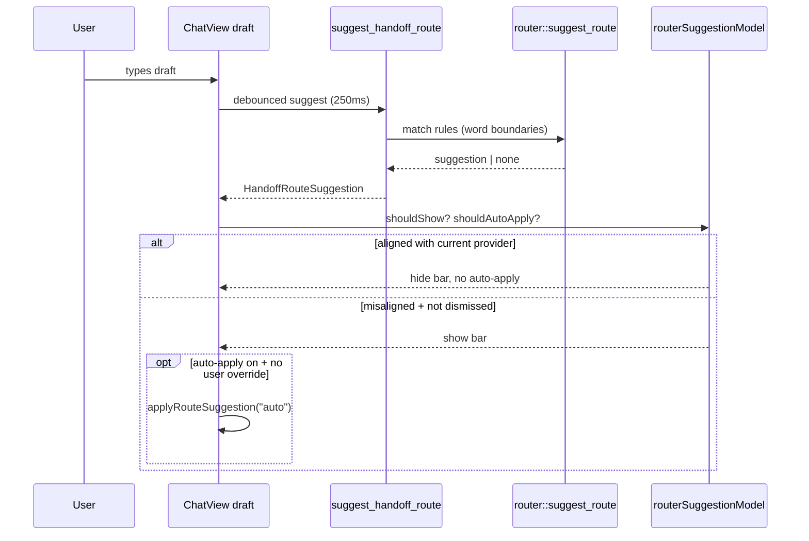

# Router Keyword False-Positive Fix — Implementation Plan

**Status:** Draft (awaiting approval)  
**Date:** 2026-06-15  
**Hand-off target:** Cursor / implementer  
**Related reports:** Chat compact redesign (`f4ee6df`) — **not the cause** of this bug

---

## Overview

Users see a persistent **Router suggestion: Code implementation** bar in Chat (and Handoffs) while typing normal prompts. With **Grok** selected, clicking **Apply suggestion** switches the provider back to **Codex**. Auto-apply (`routerAutoApply: true` by default) does the same without an explicit click.

Example that triggers the bug today:

> Hi Grok — are you able to send a message to **Codex** for me?

The seeded/custom rule **Code implementation** uses keyword `code`. Matching is a naive substring search, so **`codex` contains `code`** and the rule fires incorrectly.

This plan fixes matching, reduces noisy suggestions, and restores predictable Chat/Handoff provider selection.

---

## Root Cause Analysis

### 1. Substring keyword matching (primary bug)

```9:28:src-tauri/src/router.rs
    let haystack = format!("{} {}", request.title.trim(), request.task.trim()).to_lowercase();
    // ...
            if needle.is_empty() || !haystack.contains(&needle) {
                continue;
            }
```

`haystack.contains(needle)` matches **inside words**:

| Draft text | Keyword | False positive? |
|------------|---------|-----------------|
| `...to codex for me` | `code` | **Yes** — `codex` ⊃ `code` |
| `encode this` | `code` | **Yes** |
| `write code please` | `code` | No (intended) |
| `barcode scanner` | `code` | **Yes** |

Chat builds the haystack from `title: "Chat prompt"` + the live **composer draft** (`ChatView.tsx` lines 83–85, 219–222). Every keystroke (250 ms debounce) re-runs suggestion.

### 2. Auto-apply overrides manual provider choice

When `routerAutoApply` is on (default in `AppSettings` and `SettingsView`), `shouldAutoApplyRouter` applies the suggestion automatically (`ChatView.tsx` / `HandoffView.tsx`). There is **no check** that the user already picked a different provider intentionally.

**Apply suggestion** always calls `setSelectedProviderId(routeSuggestion.targetProviderId)` — correct for true positives, hostile for false positives.

### 3. No “already aligned” suppression

The suggestion bar renders whenever `routeSuggestion` is non-null, even if:

- `selectedProviderId === routeSuggestion.targetProviderId`, and
- the suggested model is already selected (or unset).

This creates noise without helping the user.

### 4. No dismiss / snooze UX

Once a rule matches, the bar stays until the draft changes enough to stop matching. Users cannot dismiss a bad suggestion for the current draft.

### 5. Unrelated: Chat compact redesign

The Chat layout commit (`ChatView.tsx` CSS-only restructure) did **not** change:

- `suggestHandoffRoute` / `load_router_rules`
- `router.rs` matching
- `routerAutoApplyModel.ts`
- `applyRouteSuggestion` behavior

The router suggestion renders inside the active `chat-command-area`, but the routing logic is unchanged.

---

## Goals

1. **Word-boundary keyword matching** in Rust so `code` does not match `codex`, `encode`, etc.
2. **Suppress suggestions** when the current provider/model already satisfies the suggestion (no bar, no auto-apply).
3. **Respect manual provider choice** — after the user changes provider in Chat/Handoffs, do not auto-apply a different target until the draft changes materially or the user dismisses.
4. **Dismiss control** on the suggestion bar (session-scoped per draft key).
5. **Tests** covering false-positive regressions and UI helper logic.
6. **Safer defaults** for newly seeded databases (do not rewrite existing user rules automatically).

## Non-Goals

- Removing router rules or auto-apply entirely.
- Changing `invoke` signatures.
- NLP / intent detection (“user said Grok so ignore Codex rules”).
- Handoff approval flow changes beyond shared router helpers.

---

## Proposed Design

### Phase A — Correct keyword matching (Rust, required)

**File:** `src-tauri/src/router.rs`

Replace `haystack.contains(&needle)` with **whole-token matching**:

- Treat keywords as case-insensitive tokens bounded by non-alphanumeric characters (ASCII).
- `code` matches `write code` and `code:` but **not** `codex`, `encode`, `barcode`.
- Empty/whitespace keywords remain non-matching.

```rust
fn haystack_contains_keyword(haystack: &str, keyword: &str) -> bool {
    let needle = keyword.trim();
    if needle.is_empty() {
        return false;
    }
    // scan haystack for needle at alphanumeric boundaries
}
```

**Tests to add** (`router.rs` `mod tests`):

| Haystack | Keyword | Expected |
|----------|---------|----------|
| `chat prompt hi grok send to codex` | `code` | false |
| `please write code for this` | `code` | true |
| `encode the payload` | `code` | false |
| `review the diff` | `review` | true |

**Optional seed tweak** (new DBs only in `seed_default_router_rules`):

- Change keyword `code` → `write code` or keep `code` once boundary matching lands (boundary fix alone is sufficient).

Do **not** bulk-update existing SQLite `router_rules` rows — users may rely on current keywords.

---

### Phase B — Shared frontend router UX helpers (TypeScript)

**New file:** `src/features/settings/routerSuggestionModel.ts`

Centralize logic used by **Chat** and **Handoffs**:

```ts
export function isRouterSuggestionAligned(
  suggestion: HandoffRouteSuggestion,
  selectedProviderId: string,
  selectedModelId: string,
): boolean;

export function shouldShowRouterSuggestion(
  suggestion: HandoffRouteSuggestion | null,
  selectedProviderId: string,
  selectedModelId: string,
  dismissedKey: string | null,
  requestKey: string,
): boolean;

export function shouldAutoApplyRouterSuggestion(
  enabled: boolean,
  suggestion: HandoffRouteSuggestion | null,
  requestKey: string,
  lastAppliedKey: string | null,
  selectedProviderId: string,
  selectedModelId: string,
  userOverrodeProvider: boolean,
): boolean;
```

**Alignment rules:**

- If `suggestion.targetProviderId !== selectedProviderId` → not aligned → show + allow apply.
- If `suggestion.targetModelId` is set and differs from `selectedModelId` → not aligned.
- If provider matches and model unset or matches → **aligned** → hide bar, skip auto-apply.

Extend `routerAutoApplyModel.ts` or move `shouldAutoApplyRouter` into the new module to avoid duplication.

---

### Phase C — Chat + Handoffs integration

**Files:**

- `src/features/chat/ChatView.tsx`
- `src/features/handoffs/HandoffView.tsx`

**Changes:**

1. Track `userOverrodeProvider` ref: set `true` when user changes provider/model via dropdown; reset when `routeSuggestionRequestKey` changes (new draft).
2. Track `dismissedSuggestionKey` state: set when user clicks **Dismiss** on the bar; cleared on new `requestKey`.
3. Gate `routeSuggestion` display with `shouldShowRouterSuggestion(...)`.
4. Gate auto-apply `useEffect` with `shouldAutoApplyRouterSuggestion(...)`.
5. Add **Dismiss** button beside **Apply suggestion** (secondary / ghost style).

**Manual Apply** remains available when bar is visible and not aligned.

---

### Phase D — Settings copy (minor)

**File:** `src/features/settings/SettingsView.tsx`

Clarify router keyword help text:

> Keywords match **whole words** in the prompt (e.g. `code` matches “write code” but not “Codex”).

No schema changes.

---

## Architecture (after fix)



---

## API / Interface Changes

| Layer | Change |
|-------|--------|
| Rust `router.rs` | Internal `haystack_contains_keyword`; public `suggest_route` signature unchanged |
| `suggest_handoff_route` command | Unchanged |
| TypeScript | New `routerSuggestionModel.ts`; no `invoke` changes |
| Settings SQLite | No migration |

---

## Alternatives Considered

| Alternative | Pros | Cons | Decision |
|-------------|------|------|----------|
| Disable auto-apply globally | Stops surprise switches | Loses useful automation | Reject as sole fix |
| Remove Code implementation rule | Quick | Breaks real “write code” routing | Reject |
| Frontend-only filter for “codex” | Tiny diff | Whack-a-mole for every substring | Reject |
| Regex keywords per rule | Powerful | UX complexity | Defer |
| **Word-boundary matching + aligned skip + dismiss** | Fixes class of bugs, keeps router | Small Rust + TS work | **Selected** |

---

## Acceptance Criteria

- [ ] Draft `Hi Grok — send a message to Codex for me` does **not** match keyword `code`.
- [ ] Draft `Please write code for this handler` **does** match keyword `code`.
- [ ] With **Grok** selected and a valid misaligned suggestion, bar shows; **Apply** switches provider (unchanged intentional behavior).
- [ ] With **Codex** already selected and suggestion targets Codex, bar **hidden** and auto-apply **skipped**.
- [ ] **Dismiss** hides the bar for the current draft; reappears only if draft changes to a new `requestKey`.
- [ ] After user manually changes provider dropdown, auto-apply does not revert until draft changes or user applies/dismisses.
- [ ] Handoffs tab behaves identically (shared helpers).
- [ ] `cargo test` router tests pass; `pnpm test` router model tests pass.
- [ ] Chat compact layout unaffected.

---

## PR Plan

### PR 1 — Word-boundary matching (Rust)

**Title:** `fix(router): match keywords on word boundaries`

**Files:** `src-tauri/src/router.rs`

**Dependencies:** None

---

### PR 2 — Router suggestion UX helpers

**Title:** `feat(router): aligned-check and dismiss helpers`

**Files:**

- `src/features/settings/routerSuggestionModel.ts` (new)
- `src/features/settings/routerSuggestionModel.test.ts` (new)
- `src/features/settings/routerAutoApplyModel.ts` (integrate or deprecate duplicate logic)

**Dependencies:** None (can ship before PR 1 for TS tests with mocked suggestions; ideally after PR 1)

---

### PR 3 — Chat + Handoffs wiring

**Title:** `fix(chat): suppress false router suggestions and add dismiss`

**Files:**

- `src/features/chat/ChatView.tsx`
- `src/features/handoffs/HandoffView.tsx`
- `src/styles/globals.css` (Dismiss button style only)

**Dependencies:** PR 1, PR 2

---

### PR 4 — Settings copy

**Title:** `docs(settings): clarify router keyword word matching`

**Files:** `src/features/settings/SettingsView.tsx`

**Dependencies:** PR 1

---

## Ordered Task List

1. Implement `haystack_contains_keyword` + unit tests in `router.rs`.
2. Add `routerSuggestionModel.ts` + vitest coverage.
3. Wire ChatView: aligned check, dismiss, user-override ref.
4. Wire HandoffView with same helpers.
5. Add Dismiss button styles.
6. Update Settings helper text.
7. Manual QA matrix (table below).
8. `pnpm verify`.

---

## Manual QA Matrix

| Draft | Provider selected | Keyword rule | Expected bar | Expected provider after auto-apply |
|-------|-------------------|--------------|--------------|-----------------------------------|
| `message to codex` | xai | `code` → codex | Hidden (no match) | xai |
| `write code please` | xai | `code` → codex | Shown | codex (if auto-apply on) |
| `write code please` | codex | `code` → codex | Hidden (aligned) | codex |
| `research topic` | lm-studio | `research` → xai | Shown | xai |
| User picks xai, draft matches codex rule | xai | false positive fixed | Hidden | xai |
| Shown suggestion → Dismiss | any | any | Hidden until draft edits | unchanged |

---

## Key Decisions

| Decision | Rationale |
|----------|-----------|
| Fix matching in Rust | Single source of truth for Chat, Handoffs, future MCP |
| Word boundaries, not regex | Fixes `codex`/`encode` class without Settings UI churn |
| Hide when aligned | Removes noise when suggestion adds no value |
| Dismiss per draft key | User control without persisting global state |
| `userOverrodeProvider` ref | Protects explicit provider choice from auto-apply |
| No migration of existing rules | Avoid surprising power users; boundary fix helps all keywords |

---

## Open Questions

1. **After Dismiss, should Apply stay available via Settings-only?**  
   **Recommendation:** No — dismiss hides for current draft only; editing draft can re-trigger.

2. **Should auto-apply default flip to off for existing users?**  
   **Recommendation:** No — fixing false positives is enough; keep opt-out in Settings.

3. **Grok fallback when no rule matches** (`suggest_handoff_route` lines 56–65) — leave as-is?  
   **Recommendation:** Yes — separate behavior; document in Settings that empty match + xAI available suggests Grok default in Handoffs/Chat.

---

## References

- Matcher: `src-tauri/src/router.rs`
- Suggestion command: `src-tauri/src/commands/router.rs`
- Default rules seed: `src-tauri/src/storage.rs` (`seed_default_router_rules`)
- Chat wiring: `src/features/chat/ChatView.tsx`
- Handoffs wiring: `src/features/handoffs/HandoffView.tsx`
- Auto-apply helper: `src/features/settings/routerAutoApplyModel.ts`
